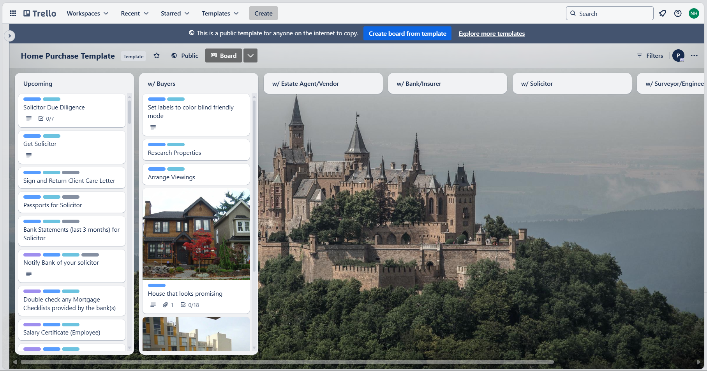
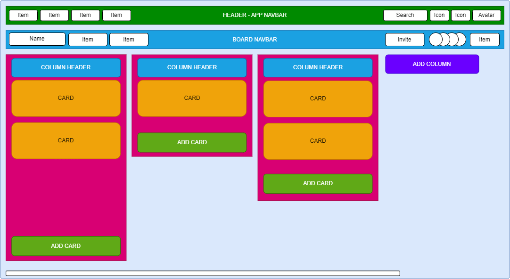

# Welcome to Trello clone

This project is a simple clone of the Trello web application which include frontend and backend.

The technologies used in this project (Frontend) include: `ReactJs` + `Vite`, `Material UI`, ...

`The technologies will be updated along the development process`

## Layout Analysis

### Trello Random Template:

### Layout Simple Analysis:

